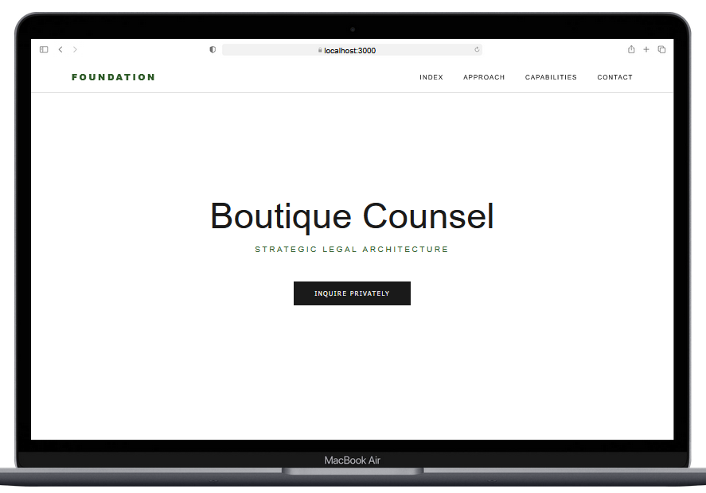

# THE FOUNDATION | Boutique Counsel

A high-fidelity React demonstration for the **Foundation Tier** legal suite. This project showcases a minimal, executive aesthetic designed for boutique law firms and private counsel.

## 🏛️ Project Architecture
- **Obsidian & Stone Palette**: Professional emerald accents with high-contrast typography.
- **Glassmorphism Header**: Distinct, blurred navigation for modern depth.
- **Custom UI Components**: Built from scratch without heavy UI libraries to ensure maximum performance.

## 🛠️ Built With
- React.js
- React Scroll (Smooth Navigation)
- CSS3 (Custom Media Queries)# THE FOUNDATION | Boutique Counsel

A high-fidelity React demonstration for the **Foundation Tier** legal suite. This project showcases a minimal, executive aesthetic designed for high-stakes litigation firms and private asset counsel.

## 🏛️ Project Architecture
- **Obsidian & Stone Palette**: Professional emerald accents (`#2d5a27`) paired with high-contrast obsidian backgrounds.
- **Architectural UI**: Custom-built div blocks for Capabilities, moving away from standard templates to a structured "Law Firm" grid.
- **Glassmorphism Header**: A distinct, blurred navigation bar that separates the interface from the hero content for better readability.
- **Themed Modals**: Replaces standard browser alerts with branded, mobile-responsive overlays for a premium user experience.

## 📱 Visual Previews
### Desktop Interface
*Clean, wide-screen layout with smooth scroll navigation.*


### Mobile Optimization
*Stacked architecture ensuring the Emerald brand remains prominent on small devices.*


## 🛠️ Built With
- **React.js**: For component-based UI architecture.
- **React Scroll**: Implementing smooth-glide navigation for single-page storytelling.
- **CSS3 Media Queries**: Custom breakpoints to ensure the logo and navigation never "cut off" on mobile devices.
- **Lucide React**: (Optional) For high-definition iconography.

## 🚀 Installation & Deployment
1. **Clone the repository**:
   ```bash
   git clone [https://github.com/glowup-digital/the-foundation.git](https://github.com/glowup-digital/the-foundation.git)